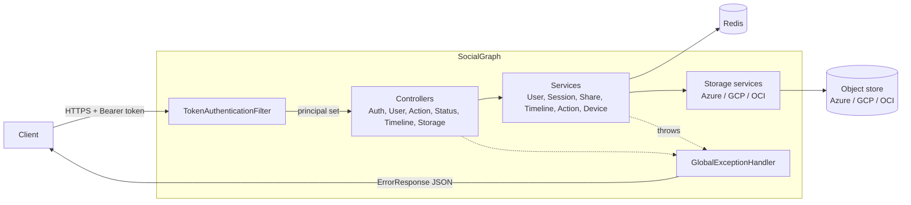
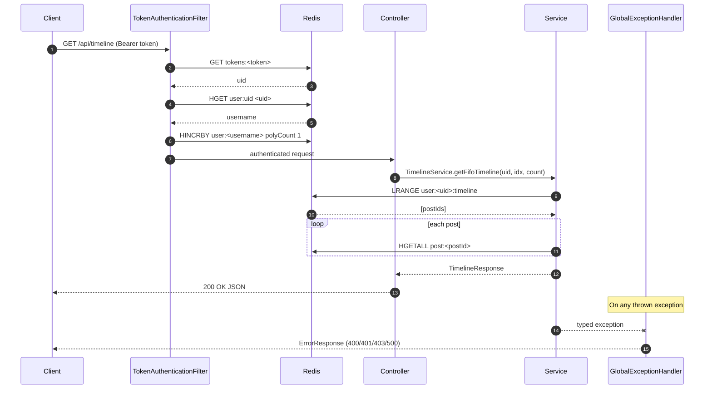
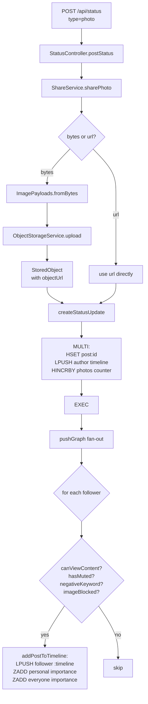

# Architecture

SocialGraph is a small, Redis-first Spring Boot service. It has no database other
than Redis and no dependency on a message broker. Media objects live in a
single pluggable object store.

## Runtime shape

## Layers

- **`controller/`** — thin HTTP adapters. No business logic. Each controller binds
  query / body / path parameters and delegates to one or more services.
- **`service/`** — business logic. `UserService` and `ShareService` own the bulk of
  the write path; `TimelineService` and `ActionService` dominate the read path.
  All services talk to Redis through `StringRedisTemplate`.
- **`service/storage/`** — object storage abstraction. `ObjectStorageService` has
  three implementations, each activated by `@ConditionalOnProperty` on
  `storage.provider`. Only one is a Spring bean at a time.
- **`security/`** — `TokenAuthenticationFilter` is a `OncePerRequestFilter` that
  reads `Authorization: Bearer ...`, resolves the token to a UID via Redis, loads
  the username, and installs an `AuthenticatedUser` principal in the
  `SecurityContext`.
- **`exception/`** — typed exceptions (`UserNotFoundException`,
  `AlreadyFollowingException`, etc.) each carry a stable error code.
  `GlobalExceptionHandler` maps them to `ErrorResponse` + HTTP status. See
  [API errors](api/errors.md).
- **`model/`** — DTOs and records. Records are used for immutable request/response
  types (`LqUploadRequest`, `LqUploadResponse`, `StoredObject`,
  `StorageUploadTarget`). Legacy mutable POJOs (`AuthResponse`, `TimelineEntry`,
  etc.) are retained where Jackson property names needed stability across the
  migration.
- **`util/`** — `Util` (UUID, MD5, unixtime) and `ImagePayloads` (MIME detection).
- **Root package** — `SocialGraphApplication` entrypoint, `Verbs` enum, and the
  two math-heavy legacy classes (`LiquidRescaler`, `PasswordHash`, `BigHex`,
  `EdgeScore`) that escaped the package move.

## Request lifecycle

## Write path: posting a status

`POST /api/status` is the clearest illustration of how the service fans state out
to every follower's timeline in a single call.

Details in [Timeline delivery](internals/timeline-delivery.md).

## Read path: timelines

Three timeline views share the same underlying delivery:

- **FIFO** (`GET /api/timeline`) — `LRANGE user:<uid>:timeline` in order.
- **Personal importance** (`GET /api/timeline/personal`) —
  `ZREVRANGE user:<uid>:timeline:personal:importance` by personal edge score
  (stored at write time, based on the author→recipient relationship).
- **Everyone importance** (`GET /api/timeline/everyone`) —
  `ZREVRANGE user:<uid>:timeline:everyone:importance` by the author's global social
  importance score.

All three rehydrate post bodies with the same
[`TimelineService.generatePost`](../src/main/java/com/intelligenta/socialgraph/service/TimelineService.java)
helper, which re-applies view-time filters (block, mute, negative keyword, image
block) so newly installed filters immediately affect existing timelines.

## Deployment model

- **Single JAR**, stateless, talks to one Redis and one object store.
- **Horizontally scalable** — no per-instance state; add more instances behind a
  load balancer. Tokens, sessions, and counters all live in Redis, so any instance
  can serve any request.
- **Redis is a hard dependency.** Lose Redis and you lose auth, posts, timelines,
  and counters.
- **The object store is a soft dependency for reads**, a hard one for writes.
  Timeline reads pull post metadata from Redis and reference `objectUrl` strings
  that point into the object store; they never read the bytes back. Writes that
  require upload (photos, liquid-rescale) fail with `storage_unavailable` or
  `media_upload_failed` if the store is unreachable.

## What isn't in this architecture

- No relational database. If one is added later, the Redis keys become a
  write-through cache and the schema in
  [Redis internals](internals/redis-schema.md) needs migration plans.
- No background workers. All work happens on the request thread, including the
  `pushGraph` fan-out. Large follower counts will stretch `POST /api/status`
  latency linearly with follower count.
- No external cache. Redis is the cache.
- No service mesh / RPC layer. Everything is a plain in-process service call.
