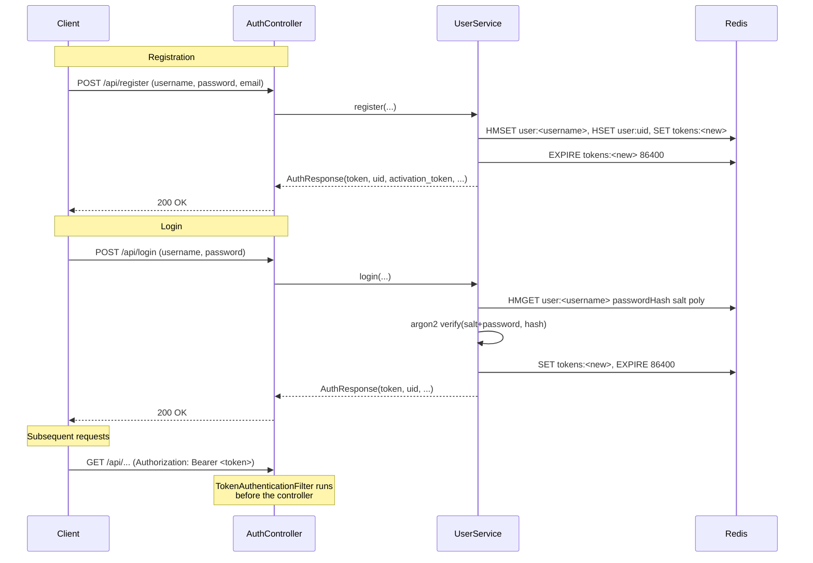

# Authentication

SocialGraph uses stateless Bearer tokens that live in Redis. There is no session
cookie, no JWT, no refresh token, and no OAuth server — a token is an opaque
string (UUID) that maps to a UID for as long as it stays in Redis.

## Token lifecycle



## Filter chain

All incoming requests pass through
[`TokenAuthenticationFilter`](../src/main/java/com/intelligenta/socialgraph/security/TokenAuthenticationFilter.java),
a `OncePerRequestFilter` registered by `SecurityConfig` **before**
`UsernamePasswordAuthenticationFilter`.

Per request, the filter:

1. Reads the `Authorization` header.
2. Strips the `Bearer ` prefix.
3. `GET tokens:<token>` in Redis. If present, the value is the UID.
4. `HGET user:uid <uid>` to resolve the username.
5. Constructs `AuthenticatedUser(uid, username)` and installs it in
   `SecurityContextHolder` as the principal of a
   `UsernamePasswordAuthenticationToken`.
6. **Side effect**: `HINCRBY user:<username> polyCount 1` bumps a per-user request
   counter. This is the sole reason the filter touches the user hash.

If any step fails, the filter leaves the `SecurityContext` empty and calls
`filterChain.doFilter` anyway — downstream routes that require authentication will
then get a 401 from Spring Security because the principal is missing.

## Public vs. authenticated endpoints

`SecurityConfig.filterChain` hardcodes the public allowlist:

```java
.requestMatchers(
    "/api/login",
    "/api/register",
    "/api/ping",
    "/api/session",
    "/api/activate"
).permitAll()
.anyRequest().authenticated()
```

| Endpoint | Why it is public |
|----------|------------------|
| `/api/ping` | Health check. |
| `/api/session` | RSA key-exchange bootstrap. Clients hit it before they have a token. |
| `/api/login` | Needs to accept credentials to mint a token. |
| `/api/register` | Needs to accept credentials to create an account. |
| `/api/activate` | Activation links in emails must be followable without logging in. |

Everything else — 35 endpoints — requires `Authorization: Bearer <token>`.

> **Note.** `AppProperties.publicEndpoints` mirrors this list under `app.public-endpoints`
> in `application.yml`, but `SecurityConfig` does **not** read that list at runtime.
> Editing the YAML does not change which routes are public. Update both the YAML
> and `SecurityConfig.filterChain` together.

## AuthenticatedUser

[`AuthenticatedUser`](../src/main/java/com/intelligenta/socialgraph/security/AuthenticatedUser.java)
implements Spring Security's `UserDetails`. It carries only `uid` and `username`;
it has no authorities (`getAuthorities()` returns an empty collection).

Controllers access it via
`@AuthenticationPrincipal AuthenticatedUser user`:

```java
@GetMapping("/me")
public ResponseEntity<Map<String, Object>> getMe(
        @AuthenticationPrincipal AuthenticatedUser user) {
    return ResponseEntity.ok(userService.getProfile(user.getUid(), user.getUid()));
}
```

In tests, the principal is injected by
[`TestAuthenticatedUserResolver`](../src/test/java/com/intelligenta/socialgraph/support/TestAuthenticatedUserResolver.java)
rather than the filter — see [Testing](testing.md).

## Token storage

| Redis key | Type | Value | TTL |
|-----------|------|-------|-----|
| `tokens:<token>` | string | `uid` | `app.security.token-expiration-seconds` (default 86400) |

Tokens are plain UUIDs generated by `Util.UUID()`. They are not signed, not
encrypted, and carry no embedded claims. Revocation is `DEL tokens:<token>` — the
code does not currently implement a logout endpoint, so revocation is manual at
the Redis level.

Because tokens are opaque, the only way to identify a user is via the Redis
lookup. This is fine at small to medium scale; at large scale the per-request
`GET tokens:<token>` + `HGET user:uid <uid>` round-trip becomes the hot path and is
the obvious first place to add a local LRU cache.

## Session bootstrap (`/api/session`)

Distinct from the Bearer token. `/api/session` is a separate key-exchange
endpoint preserved from the legacy design:

- `GET /api/session?uuid=<optional-client-uuid>` returns a server RSA public key.
- The private key is stored at `session:<uuid>` with a 1-day TTL.
- Clients use the returned `pubKey` to wrap sensitive payloads.

This endpoint is the **only** legacy crypto helper that survived the migration.
The advanced-auth routes (`/api/aes/key`, `/api/get/image`, etc.) were intentionally
dropped — see [the changelog](../CHANGELOG.md) and
[`ApiSurfaceRegressionTest`](../src/test/java/com/intelligenta/socialgraph/ApiSurfaceRegressionTest.java)
for the enforcement.

## Password hashing

[`PasswordHash`](../src/main/java/com/intelligenta/socialgraph/PasswordHash.java)
exposes two hash families:

- **Argon2** — `createArgon2Hash` / `validateArgon2Hash`. This is what
  `UserService.register` and `UserService.login` call today. Argon2 parameters:
  `iterations=3`, `memory=65536`, `parallelism=4`.
- **PBKDF2** (legacy, `createHash` / `validatePassword`) — retained for
  compatibility with pre-migration hashes. The code path is not reached during
  registration; new accounts always use Argon2.

A user-provided password is salted before hashing: `argon2(salt + password)`. The
salt is generated by `PasswordHash.createSalt()` and stored alongside the hash in
the user's Redis hash at field `salt`.

## Related pages

- [Configuration](configuration.md) — how to change the token TTL and where
  public endpoints are listed.
- [API: auth](api/auth.md) — request / response shapes for each auth endpoint.
- [Internals: security filter](internals/security-filter.md) — filter internals
  and Redis lookup details.
