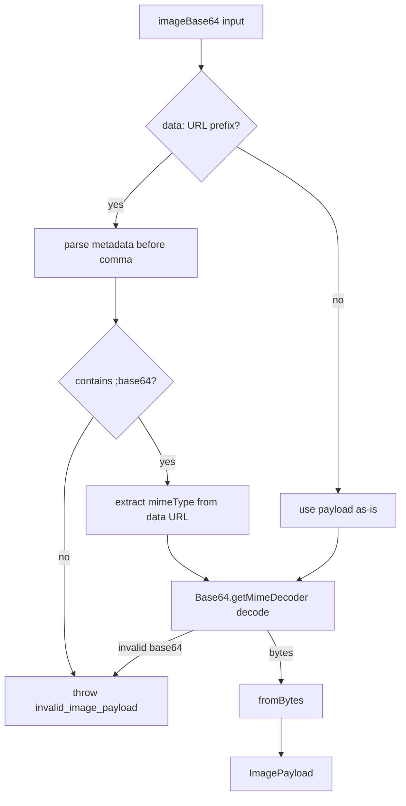
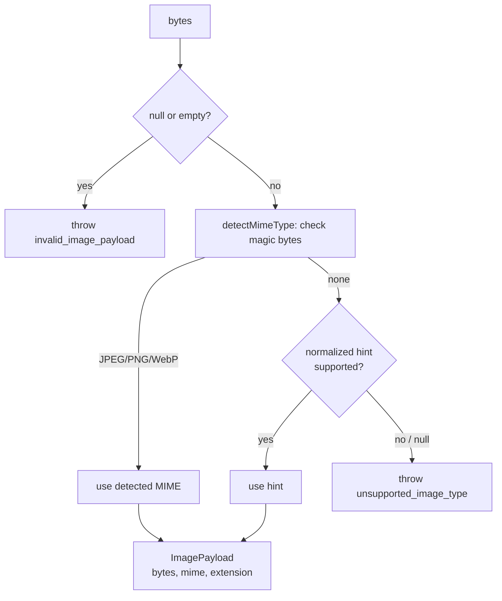
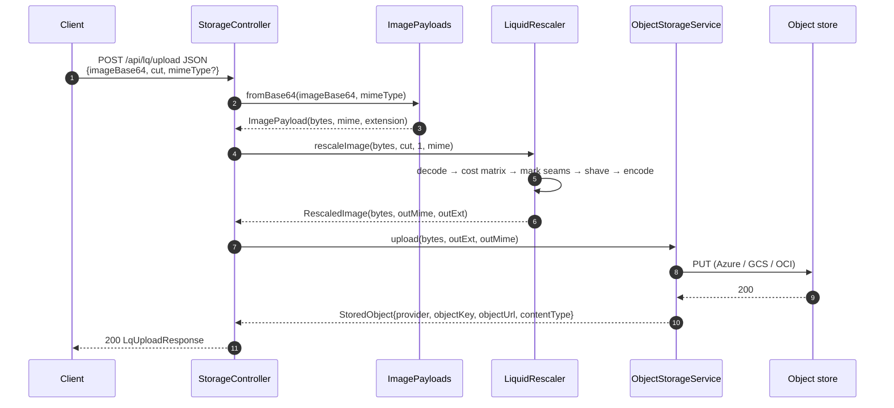
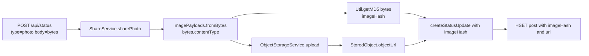

# Image pipeline

The image pipeline has two parts: format detection / MIME normalization
(`ImagePayloads`) and seam-carving width reduction (`LiquidRescaler`). The two
work together in `POST /api/lq/upload`, and `ImagePayloads` is also used by
`ShareService.sharePhoto` when bytes come in over `POST /api/status`.

Authoritative code:
[`util/ImagePayloads.java`](../../src/main/java/com/intelligenta/socialgraph/util/ImagePayloads.java),
[`LiquidRescaler.java`](../../src/main/java/com/intelligenta/socialgraph/LiquidRescaler.java),
[`controller/StorageController.java`](../../src/main/java/com/intelligenta/socialgraph/controller/StorageController.java).

## Supported MIME types

Only three image formats are accepted anywhere in the pipeline:

| MIME type | Extension | Magic bytes |
|-----------|-----------|-------------|
| `image/jpeg` | `.jpg` | `FF D8 FF` |
| `image/png` | `.png` | `89 50 4E 47 0D 0A 1A 0A` |
| `image/webp` | `.webp` | `RIFF....WEBP` |

Aliases (`image/jpg`, `image/x-png`, `image/x-webp`) are normalized via
`ImagePayloads.normalizeMimeType`.

Anything else — GIF, AVIF, HEIC, TIFF, SVG, PDF — fails fast with
`unsupported_image_type`.

## `ImagePayloads`

Two entry points:

### `fromBase64(imageBase64, requestedMimeType)`

Parses a base64 string into an `ImagePayload(bytes, mimeType, extension)`.
Handles both raw base64 and `data:image/png;base64,...` data URLs.



### `fromBytes(bytes, requestedMimeType)`

Detects the MIME from the magic bytes first, then falls back to the caller's
hint if detection fails.



The detector wins over the caller's hint when it has a result. This prevents
clients from lying about the MIME to sneak through an unsupported format.

### Normalization and allow-listing

- `normalizeMimeType("IMAGE/JPG")` → `"image/jpeg"` (alias folded; parameters
  like `;charset=utf-8` stripped).
- `normalizeRequestedMimeType("application/octet-stream")` → `null` (treated
  as "no hint").
- Any non-alias MIME that is not in the allow-list
  (`image/jpeg`, `image/png`, `image/webp`) throws immediately — even if the
  detector has not run yet.

### Extension resolution

`extensionForMimeType` maps the normalized MIME back to the file extension used
for generated object keys (`.jpg`, `.png`, `.webp`). This is what
`AbstractObjectStorageService.nextObjectKey` uses to build the final object key.

## `LiquidRescaler`

`LiquidRescaler` is a pure-Java seam carving implementation, originally authored
by Jacopo Farina (2014) and preserved through the migration. Seam carving shaves
vertical seams from an image to reduce its width while preserving "important"
content.

**Primary entry point used by the HTTP layer:**

```java
public static RescaledImage rescaleImage(
    byte[] sourceBytes,
    int numPixelsToRemove,
    int stepSize,
    String preferredMimeType
) throws IOException
```

- `sourceBytes` — raw input bytes (not base64).
- `numPixelsToRemove` — how much to shave off the width. Must be strictly less
  than the image width; otherwise `invalid_image_payload`.
- `stepSize` — how many seams to carve per pass. Smaller = more precise, slower.
  The HTTP path uses `1`.
- `preferredMimeType` — hint for the output format. If ImageIO cannot write the
  hinted format it falls back to `image/png`, then `image/jpeg`, then throws.

Returns `RescaledImage(byte[] bytes, String mimeType, String extension)`.

Internally:

1. `getMinVarianceMatrix(image)` computes a cumulative cost matrix over pixel
   gradient differences.
2. `markBestPaths(matrix, n)` marks the `n` lowest-cost seams as
   `Integer.MAX_VALUE`.
3. `rescaleImage(image, matrix, n)` copies the non-marked pixels into a new
   image of reduced width.
4. `rescaleImageInSteps` repeats steps 1–3 `stepSize` pixels at a time, letting
   the cost matrix re-converge after each pass.
5. `chooseOutputMimeType` picks a writer-compatible output format.

This is CPU-bound and runs on the request thread. The code works on small
images; at production sizes it becomes a latency hot path and is a candidate for
a native Rust port (the legacy README calls this out).

## `POST /api/lq/upload` end to end



## `POST /api/status` with raw photo bytes

A lighter path — no rescale, just upload:



The `imageHash` returned by `Util.getMD5` feeds straight into the post hash so
`ShareService.shouldDeliver` and `TimelineService.generatePost` can cross-check
against recipients' `user:<uid>:images:blocked:md5` filters.

## Error codes emitted

| Where | Code | Typical cause |
|-------|------|---------------|
| `fromBase64` — no comma in data URL | `invalid_image_payload` | Malformed `data:` prefix |
| `fromBase64` — no `;base64` | `invalid_image_payload` | Data URL not base64 |
| `fromBase64` — `Base64.decode` fails | `invalid_image_payload` | Not valid base64 |
| `fromBytes` — null / empty | `invalid_image_payload` | Upload body empty |
| `fromBytes` — no MIME hint, no detection | `unsupported_image_type` | Unknown format |
| `normalizeRequestedMimeType` — alien format | `unsupported_image_type` | GIF, AVIF, etc. |
| `rescaleImage` — `cut >= width` | `invalid_image_payload` | User asked to shave more than the image width |
| `rescaleImage` — ImageIO cannot decode | `invalid_image_payload` | Corrupt bytes |
| `rescaleImage` — no compatible writer | `invalid_image_payload` | Writer missing for output MIME |

All of these surface as `400` through `GlobalExceptionHandler`.

## Related

- [API: storage](../api/storage.md) — the two HTTP entry points.
- [Storage providers](storage-providers.md) — where the final bytes land.
- [Timeline delivery](timeline-delivery.md) — where `imageHash` is used.
