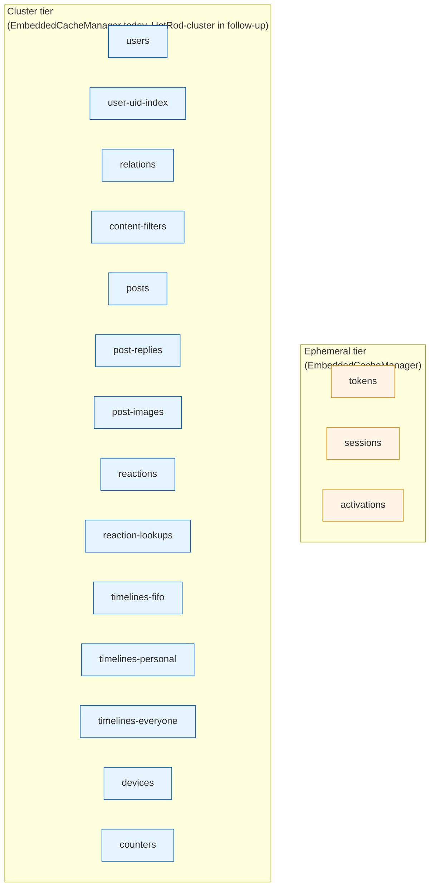

# Infinispan cache schema

Companion to [`redis-schema.md`](redis-schema.md). This page describes the cache
layout when SocialGraph runs with `persistence.provider=infinispan` and
`persistence.infinispan.client-mode=native`. In RESP mode the Redis schema
applies verbatim (Infinispan's RESP endpoint is bytewise-compatible with what
the Redis-store implementations write).

Source of truth: [`InfinispanConfig.Native#embeddedCacheManager`](../../src/main/java/com/intelligenta/socialgraph/config/InfinispanConfig.java).
All caches are defined in LOCAL mode today; the plan promotes the cluster-tier
caches to DIST_SYNC and the ephemeral-tier caches to REPL_ASYNC when JGroups
clustering lands.

## Cache tiers

## Ephemeral tier

Configured with `expiration.lifespan = persistence.infinispan.ephemeral-ttl`
(ISO-8601 `Duration`, default `PT24H`).

| Cache | Key type | Value type | Writer | Reader |
|---|---|---|---|---|
| `tokens` | `String` (bearer token) | `String` (uid) | `InfinispanTokenStore#issue` | `TokenAuthenticationFilter`, `UserService.authenticatedUser` |
| `sessions` | `String` (session uuid) | `Map<String,String>` (`publicKey`, `privateKey`) | `InfinispanSessionStore#put` | `InfinispanSessionStore#get` |
| `activations` | `String` (activation token) | `String` (uid) | `InfinispanUserStore#register` | `InfinispanUserStore#consumeActivationToken` |

## Cluster tier

No TTL — entries live until explicitly removed.

### Users

| Cache | Key | Value | Purpose |
|---|---|---|---|
| `users` | username | `Map<String,String>` (profile fields: `passwordHash`, `salt`, `poly`, `uuid`, `email`, `created`, `followers`, `following`, `activated`, `fullname`, `bio`, `profilePicture`, `polyCount`) | Primary user records; keyed by username for direct login lookups |
| `user-uid-index` | uid | username | Reverse lookup; the only way to hydrate a UID into a profile |

Counter fields (`followers`, `following`, `polyCount`) live on the username
record in the `users` cache and are mutated with optimistic read-modify-write
in [`InfinispanUserStore#incrementField`](../../src/main/java/com/intelligenta/socialgraph/persistence/infinispan/InfinispanUserStore.java).
Phase follow-up promotes these to `CounterManager` weak counters (for
`polyCount`) and strong counters (for per-user photo/video/post counts).

### Relations

| Cache | Key | Value | Purpose |
|---|---|---|---|
| `relations` | uid | `Map<Relation, HashSet<String>>` where `Relation ∈ {FOLLOWERS, FOLLOWING, BLOCKED, BLOCKERS, MUTED, MUTERS}` | The six directional-set views, grouped per user for locality |

`follow`, `unfollow`, `block`, `unblock`, `mute`, `unmute` each mutate two
entries (the actor's outgoing view + the target's incoming view). JTA-wrapped
atomicity is a follow-up — today both writes happen sequentially.

### Content filters

| Cache | Key | Value | Purpose |
|---|---|---|---|
| `content-filters` | uid | `Map<String, HashSet<String>>` with keys `"keywords"` and `"images"` | Per-user negative-keyword and blocked-image filters |

Consulted at delivery time (`ShareService.shouldDeliver`) and at read time
(`TimelineService.generatePost`).

### Posts

| Cache | Key | Value | Purpose |
|---|---|---|---|
| `posts` | postId | `Map<String,String>` (`id`, `type`, `uid`, `created`, `content`, `url`, `imageHash`, `imageCount`, `parentId`, `sharedPostId`, `updated`) | Post records |
| `post-replies` | parent postId | `ArrayList<String>` (reply postIds, newest-first) | Reply threads |
| `post-images` | postId | `ArrayList<String>` (image URLs in author order) | Multi-image posts |

Post type values: `text`, `photo`, `video`, `audio`, `reply`, `reshare`.

### Reactions

The Infinispan impl uses cleaner key shapes than the Redis adapter (no
"unusual" concatenated suffix) because no API regression depends on the
Infinispan keys.

| Cache | Key | Value | Purpose |
|---|---|---|---|
| `reactions` | `<postId>:<verb>` (e.g. `abc123:like`) | `ArrayList<String>` (actor uids, newest-first) | Pagination list per post per verb |
| `reaction-lookups` | postId | `Map<actorUid, HashSet<String>>` of verb strings | O(1) `containsAction` lookup |

Verb values: `like`, `love`, `fav`, `share`.

### Timelines

| Cache | Key | Value | Purpose |
|---|---|---|---|
| `timelines-fifo` | uid | `ArrayList<String>` (post IDs, newest-first) | FIFO feed |
| `timelines-personal` | uid | `LinkedHashMap<String, Double>` (postId → personal-edge score) | Personal-importance ranked feed |
| `timelines-everyone` | uid | `LinkedHashMap<String, Double>` (postId → author's global social-importance) | Global-importance ranked feed |

Ranked reads today iterate the map client-side, sort by score descending, and
slice. The planned Ickle `ORDER BY score DESC LIMIT` query against an
`@Indexed` cache of `TimelineEntry { uid, score, postId, timestamp }` is a
follow-up.

### Devices

| Cache | Key | Value | Purpose |
|---|---|---|---|
| `devices` | **username** | `HashSet<String>` (device IDs) | Per-user registered devices |

Keyed by username, matching the Redis legacy — `DeviceService` accepts
username.

### Counters

| Cache | Key | Value | Purpose |
|---|---|---|---|
| `counters` | `"photos"` / `"videos"` / `"posts"` | `Map<uid, Long>` | Per-user content counts |

The three global buckets each hold a user→count map. Strong-counter promotion
(via `CounterManager.getStrongCounter`) lands in the JTA refinement.

## Gap matrix (vs. the Redis schema)

| Redis feature | Infinispan native status | Follow-up |
|---|---|---|
| `user:<uid>:crypto.publicKey` (RSA public key) | not stored in native mode | Phase follow-up adds a dedicated `user-crypto` cache |
| `user:<authorUid>:connection:edgescore:*` (per-edge edge score) | not stored | Service falls back to `0.0`; production would seed these via a background job |
| `user:social:importance` (global social-importance zset) | not stored | Same as above |
| `embedding:queue` + DLQ (Redis Streams) | not implemented | Phase I-J follow-up: `CounterManager` sequence + `@ClientListener` on an `embedding-queue` cache |
| `embedding:post:<provider>:<dim>:<postId>` + `idx:post:embedding:*` (RediSearch HNSW) | not implemented | Phase I-I follow-up: Protobuf `@Indexed` `PostEmbedding` + Ickle k-NN |
| `MULTI`/`EXEC` atomicity on user registration / post creation | degraded — sequential writes | Phase follow-up: transactional cache + JTA |

Features listed above are disabled under native mode today; the corresponding
controllers / beans are gated on `persistence.provider=redis` via
`@ConditionalOnProperty`.

## Ownership table

| Store interface | Writer cache(s) | Reader cache(s) |
|---|---|---|
| `InfinispanTokenStore` | `tokens` | `tokens` |
| `InfinispanSessionStore` | `sessions` | `sessions` |
| `InfinispanUserStore` | `users`, `user-uid-index`, `activations`, `tokens` | `users`, `user-uid-index`, `activations` |
| `InfinispanRelationStore` | `relations` | `relations` |
| `InfinispanContentFilterStore` | `content-filters` | `content-filters` |
| `InfinispanPostStore` | `posts`, `post-replies`, `post-images` (+ `counters` via `CounterStore`) | `posts`, `post-replies`, `post-images` |
| `InfinispanReactionStore` | `reactions`, `reaction-lookups` | `reactions`, `reaction-lookups` |
| `InfinispanTimelineStore` | `timelines-fifo`, `timelines-personal`, `timelines-everyone` | same |
| `InfinispanDeviceStore` | `devices` | `devices` |
| `InfinispanCounterStore` | `counters` | `counters` |

## Related

- [Persistence](../persistence.md) — provider selection + operational docs.
- [Persistence abstraction](persistence-abstraction.md) — the store interfaces.
- [Redis schema](redis-schema.md) — the corresponding Redis layout.
