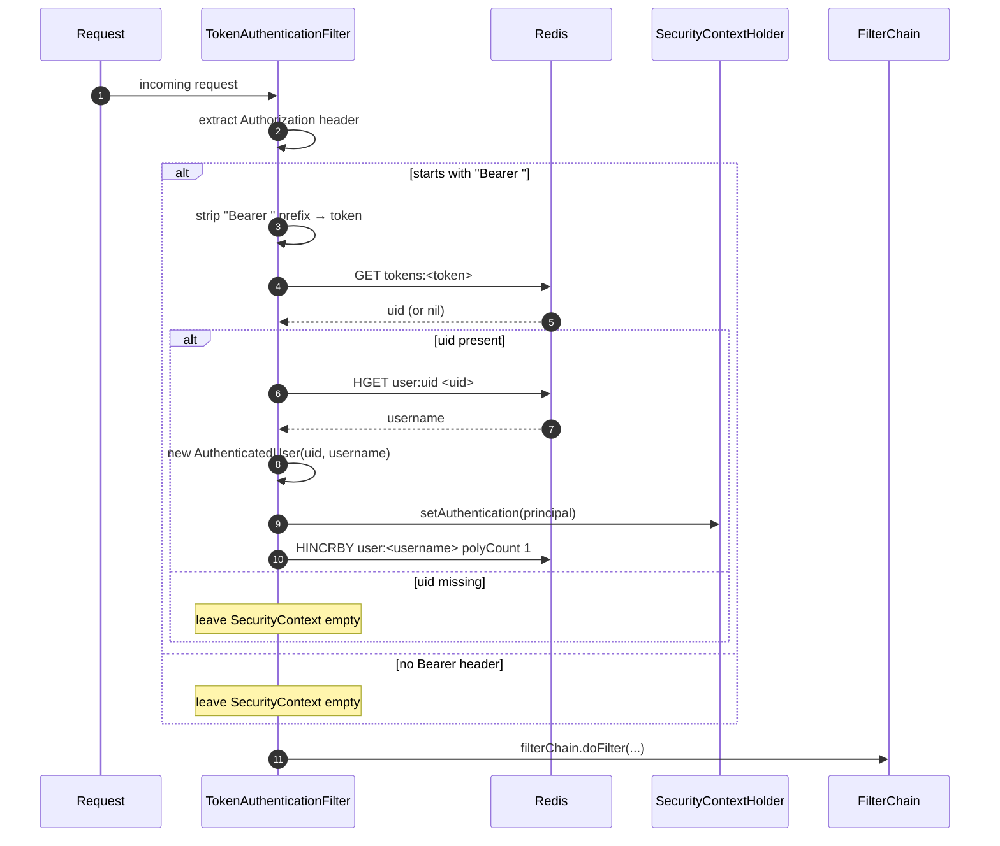

# Security filter internals

[`TokenAuthenticationFilter`](../../src/main/java/com/intelligenta/socialgraph/security/TokenAuthenticationFilter.java)
is the single piece of authentication machinery in the app. It reads the
`Authorization` header, resolves the token to a UID via Redis, loads the
username, builds an `AuthenticatedUser`, and installs it in Spring's
`SecurityContext`.

This page describes the filter in detail, why the ordering matters, and what
each Redis call does.

## Filter registration

`SecurityConfig` registers the filter via:

```java
.addFilterBefore(tokenAuthenticationFilter, UsernamePasswordAuthenticationFilter.class)
```

That means: for every request, `TokenAuthenticationFilter.doFilterInternal`
runs before `UsernamePasswordAuthenticationFilter` in the servlet filter chain.
Since SocialGraph never uses `UsernamePasswordAuthenticationFilter` (no form
login), the chain effectively becomes:

```
Request → TokenAuthenticationFilter → SecurityFilterChain rules → Controller
```

The `authorizeHttpRequests` block then decides 401 vs. pass-through based on
whether the principal is present. If `TokenAuthenticationFilter` left the
context empty — either because the header was missing, malformed, or the
lookup failed — any non-public route returns 401 via Spring Security's
`AuthenticationEntryPoint`.

## Algorithm



## Step-by-step

### 1. Extract the token

```java
String bearerToken = request.getHeader("Authorization");
if (StringUtils.hasText(bearerToken) && bearerToken.startsWith("Bearer ")) {
    return bearerToken.substring(7);
}
return null;
```

- Only `Authorization: Bearer <token>` is recognized.
- Query-string tokens are not supported (intentional — see the
  [changelog](../../CHANGELOG.md) breaking change note).
- Missing header → filter short-circuits to `filterChain.doFilter` without
  setting any principal.

### 2. Resolve token → UID

```java
String uid = redisTemplate.opsForValue().get("tokens:" + token);
```

- Key: `tokens:<token>`.
- Value: the UID string.
- TTL: `app.security.token-expiration-seconds` (default 86400 seconds, set at
  token creation by `UserService.register` and `login`).
- Miss → filter proceeds without setting a principal.

### 3. Resolve UID → username

```java
String username = (String) redisTemplate.opsForHash().get("user:uid", uid);
```

- Key: `user:uid` hash.
- Field: the UID.
- Value: username (null if the UID is unknown).

### 4. Install the principal

```java
AuthenticatedUser user = new AuthenticatedUser(uid, username);
UsernamePasswordAuthenticationToken authentication =
    new UsernamePasswordAuthenticationToken(user, null, user.getAuthorities());
authentication.setDetails(new WebAuthenticationDetailsSource().buildDetails(request));
SecurityContextHolder.getContext().setAuthentication(authentication);
```

- `AuthenticatedUser.getAuthorities()` is an empty collection — there are no
  roles in the system, so authorization is essentially binary (authenticated or
  not).
- `setDetails` records the remote IP and session ID on the authentication object
  for downstream audit use.

### 5. Side effect: bump the per-user counter

```java
if (username != null) {
    redisTemplate.opsForHash().increment("user:" + username, "polyCount", 1);
}
```

- Field: `polyCount` on the user's hash.
- Purpose: coarse per-user request counter. Only incremented when the token was
  valid and the username resolved, so it approximates authenticated requests
  per user.
- **Cost:** one extra Redis round trip on every authenticated request. Turn this
  off if you profile and it shows up hot.

## Errors inside the filter

The entire body is wrapped in try/catch:

```java
try {
    // all of the above
} catch (Exception e) {
    log.error("Cannot set user authentication", e);
}
filterChain.doFilter(request, response);
```

Any Redis error, any parsing error, any NullPointerException is logged and
swallowed. The filter then calls the next filter without a principal. This is
intentional — a Redis blip should not 500 every public request — but it means
auth failures are nearly indistinguishable from "no token sent" at the HTTP
layer. Look at the logs for the actual cause.

## Public endpoints

`SecurityConfig` allows these through unauthenticated (hardcoded in the filter
chain, mirrored in `app.public-endpoints` for documentation):

- `/api/login`
- `/api/register`
- `/api/ping`
- `/api/session`
- `/api/activate`

Even on a public endpoint `TokenAuthenticationFilter` still runs — it just
cannot install a principal if no token is present (or a bogus token is sent).
There is no shortcut check.

## Test injection

Controller tests use
[`TestAuthenticatedUserResolver`](../../src/test/java/com/intelligenta/socialgraph/support/TestAuthenticatedUserResolver.java)
+
[`TestRequestPostProcessors`](../../src/test/java/com/intelligenta/socialgraph/support/TestRequestPostProcessors.java)
to inject `@AuthenticationPrincipal AuthenticatedUser` **without** going through
the real filter. `standaloneSetup` MockMvc bypasses Spring Security entirely; the
custom `HandlerMethodArgumentResolver` reads the UID and username from request
attributes set by the post-processor and constructs an `AuthenticatedUser`
directly.

This is the right compromise for unit-level controller tests — the filter
itself is tested separately in `TokenAuthenticationFilterTest`, and the full
security chain is exercised in `SecurityConfigTest`.

## Known cost and scaling notes

- **Two Redis round trips per authenticated request** (`GET` + `HGET`), plus
  the counter bump (`HINCRBY`) — three round trips total. At moderate
  concurrency this is the hot path. A local LRU token cache keyed by token
  with a short TTL would cut this to ~one round trip on cache miss.
- **No rate limiting.** Tokens are opaque and `polyCount` is advisory; there is
  nothing preventing a loud client from drowning the service.
- **No token revocation endpoint.** `DEL tokens:<token>` via a privileged tool
  is the only way.

## Related

- [Authentication](../authentication.md) — higher-level model.
- [Redis schema](redis-schema.md) — `tokens:*` and `user:uid` details.
- [API: auth](../api/auth.md) — token issuance endpoints.
