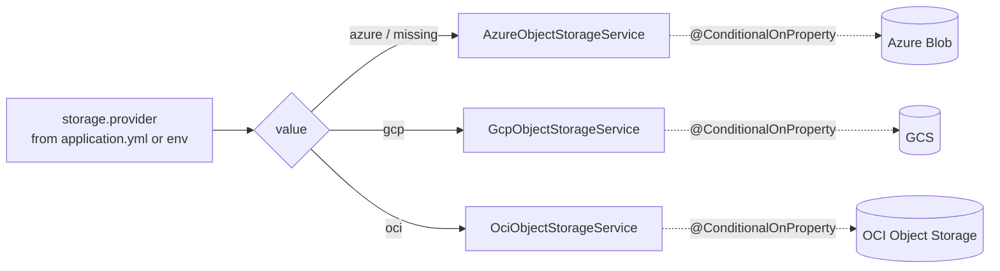

# Storage providers

SocialGraph's media storage is an `ObjectStorageService` interface with three
implementations. Exactly one is active at a time, picked by the `storage.provider`
property.

Authoritative code:
[`service/storage/`](../../src/main/java/com/intelligenta/socialgraph/service/storage/).

## Interface

```java
public interface ObjectStorageService {
    String provider();
    StorageUploadTarget createSignedUploadTarget(String extension, String contentType);
    StoredObject upload(byte[] bytes, String extension, String contentType);
    void download(String objectKey, OutputStream outputStream);
}
```

- `provider()` — returns the short string (`"azure"`, `"gcp"`, `"oci"`) used in
  response DTOs.
- `createSignedUploadTarget(ext, contentType)` — returns a
  [`StorageUploadTarget`](../../src/main/java/com/intelligenta/socialgraph/model/StorageUploadTarget.java):
  `{provider, objectKey, objectUrl, uploadUrl, method, headers, expiresIn}`.
  The caller `PUT`s to `uploadUrl` with the listed `headers` (and any body).
- `upload(bytes, ext, contentType)` — performs the upload server-side and
  returns a [`StoredObject`](../../src/main/java/com/intelligenta/socialgraph/model/StoredObject.java):
  `{provider, objectKey, objectUrl, contentType}`.
- `download(objectKey, os)` — streams an object to the output stream. Used
  internally; not exposed over HTTP.

Both write paths go through the same object-key generator in
[`AbstractObjectStorageService.nextObjectKey`](../../src/main/java/com/intelligenta/socialgraph/service/storage/AbstractObjectStorageService.java):
`<prefix><uuid><extension>` — where `prefix` is `storage.object-key-prefix`
(trailing `/` inferred) and `extension` is either `".png"`, `".jpg"`, `".webp"`,
or empty.

## Provider selection



Each implementation has a `@ConditionalOnProperty(prefix="storage", name="provider", ...)` annotation:

| Class | `havingValue` | `matchIfMissing` |
|-------|---------------|------------------|
| `AzureObjectStorageService` | `azure` | `true` (default when unset) |
| `GcpObjectStorageService` | `gcp` | false |
| `OciObjectStorageService` | `oci` | false |

The inactive classes are excluded from the Spring application context, so the
unused SDK dependencies are still on the classpath but their clients are never
instantiated.

## Startup and failure modes

Each provider initializes in `@PostConstruct`. Initialization failures are
**logged and swallowed** — the bean stays in the context but its client field is
`null`. Any subsequent call will throw `SocialGraphException("storage_unavailable", ...)`
and surface as a `400 storage_unavailable` error (via
[`GlobalExceptionHandler`](../../src/main/java/com/intelligenta/socialgraph/exception/GlobalExceptionHandler.java)).

This lets the app come up with broken storage configuration so developers can
poke around non-upload endpoints, at the cost of late failure rather than fail-fast.
If you want fail-fast, change the catch blocks in each `init()` method to rethrow.

## Azure Blob Storage

[`AzureObjectStorageService`](../../src/main/java/com/intelligenta/socialgraph/service/storage/AzureObjectStorageService.java).

- **Client:** `BlobServiceClient` built from `storage.azure.connection-string`.
- **Container:** `storage.azure.container-name` (default `photos`). Created on
  startup if absent.
- **Upload target (`createSignedUploadTarget`):** generates a new object key,
  asks the blob for its `generateSas(...)` with `create / write / read`
  permissions and `OffsetDateTime.now() + signedUrlTtlSeconds`. Returns the
  blob URL for both `objectUrl` (read) and `<blob-url>?<sas>` for `uploadUrl`.
  Headers include `x-ms-blob-type: BlockBlob`; adds `Content-Type` if the caller
  passed one.
- **Server-side upload (`upload`):** wraps the bytes in a
  `ByteArrayInputStream`, calls `blobClient.upload(stream, length, true)` (with
  overwrite), then `setHttpHeaders` for the content type if provided. Returns a
  `StoredObject` with `blobClient.getBlobUrl()`.
- **Download:** `blobClient.downloadStream` into an intermediate
  `ByteArrayOutputStream`, then written to the caller's stream.

Relevant env vars:

| Variable | Used by |
|----------|---------|
| `AZURE_STORAGE_CONNECTION_STRING` | `BlobServiceClientBuilder.connectionString` |
| `AZURE_STORAGE_CONTAINER` | container name |

See [configuration](../configuration.md#azure-blob-storage) for the full list.

## Google Cloud Storage

[`GcpObjectStorageService`](../../src/main/java/com/intelligenta/socialgraph/service/storage/GcpObjectStorageService.java).

- **Client:** `StorageOptions.newBuilder().setProjectId(...).build().getService()`.
  Credentials come from Application Default Credentials (GCE metadata, workload
  identity, or `GOOGLE_APPLICATION_CREDENTIALS`).
- **Bucket:** `storage.gcp.bucket-name`. The startup path calls
  `storage.get(bucketName)` and logs a warning if it is missing, but does not
  create it.
- **Upload target:** `storage.signUrl` with `HttpMethod.PUT`,
  `withV4Signature()`, and the caller's content type added via
  `withExtHeaders`. Returns `signedUrl.toString()` as `uploadUrl`.
- **Server-side upload:** `storage.create(blobInfo, bytes)`.
- **`objectUrl`:** the public HTTPS URL
  `https://storage.googleapis.com/<bucket>/<encodedObjectKey>`.
- **Download:** `storage.readAllBytes(BlobId.of(bucket, key))`.

## Oracle Cloud Infrastructure Object Storage

[`OciObjectStorageService`](../../src/main/java/com/intelligenta/socialgraph/service/storage/OciObjectStorageService.java).

- **Client:** `ObjectStorageClient(ConfigFileAuthenticationDetailsProvider(...))`
  — either with an explicit config file (`storage.oci.config-file`) or the SDK
  default (`~/.oci/config`), and a profile (`storage.oci.profile`, default
  `DEFAULT`).
- **Endpoint:** explicit `storage.oci.endpoint` wins; otherwise the region is
  mapped via `Region.fromRegionId(region)`. If neither is set, operations that
  need `baseEndpoint()` throw `storage_unavailable`.
- **Upload target:** creates a Pre-Authenticated Request (PAR) with
  `AccessType.ObjectWrite` and expiry `now + signedUrlTtlSeconds * 1000`. The
  final URL is `baseEndpoint() + par.getAccessUri()`.
- **Server-side upload:** `objectStorageClient.putObject(...)` with the bytes,
  content length, and optional content type.
- **`objectUrl`:** composed as
  `<baseEndpoint>/n/<namespace>/b/<bucket>/o/<encodedKey>`.
- **Shutdown:** `@PreDestroy` calls `objectStorageClient.close()`.

## Where the controllers touch the provider

- [`StorageController.requestStorageKey`](../../src/main/java/com/intelligenta/socialgraph/controller/StorageController.java)
  → `createSignedUploadTarget(null, null)`.
- `StorageController.uploadWithRescale` → `upload(rescaled.bytes, ext, mime)`.
- [`ShareService.sharePhoto(uid, content, bytes, contentType)`](../../src/main/java/com/intelligenta/socialgraph/service/ShareService.java)
  → `upload(bytes, ext, mime)` after `ImagePayloads.fromBytes`.

No controller or service calls `download` today; it is reserved for
administrative tooling.

## Adding a new provider

1. Create `<Name>ObjectStorageService extends AbstractObjectStorageService`.
2. Annotate with
   `@Service` and
   `@ConditionalOnProperty(prefix="storage", name="provider", havingValue="<name>")`.
3. Implement `provider()`, `createSignedUploadTarget`, `upload`, and `download`.
4. Add a nested properties class to
   [`StorageProperties`](../../src/main/java/com/intelligenta/socialgraph/config/StorageProperties.java),
   plus a `storage.<name>.*` block in `application.yml` with the env-var placeholders.
5. Add a row to [Configuration](../configuration.md) and this page.
6. Add a `@ConditionalOnProperty`-filtered test covering provider bootstrap.

## Related

- [API: storage](../api/storage.md) — the two HTTP entry points.
- [Image pipeline](image-pipeline.md) — how uploads get to this layer.
- [Configuration](../configuration.md#object-storage-shared) — full env var list.
