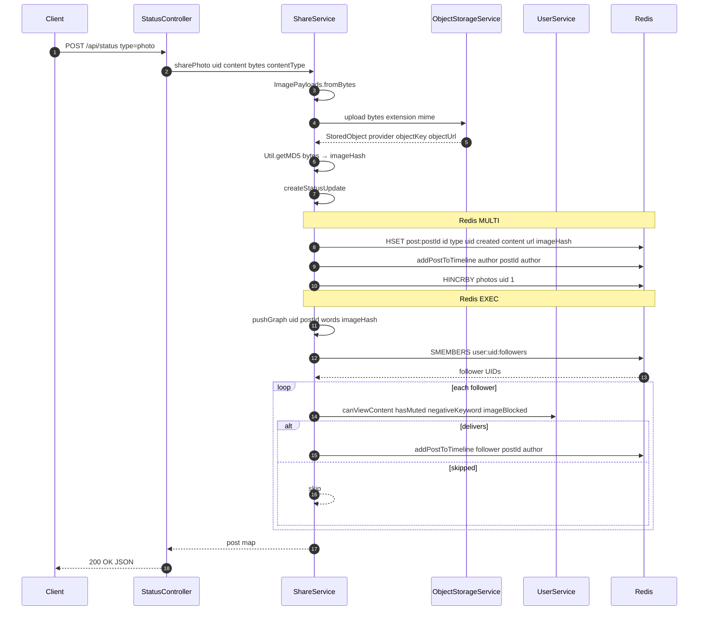
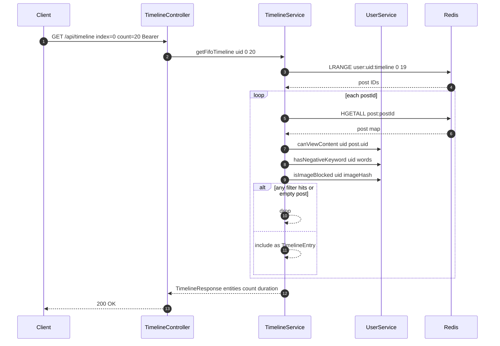

# Timeline delivery

Timelines in SocialGraph are **push-on-write**: when a user posts, the server
iterates their follower set and writes the new post into each follower's
timeline in the same request. There are no background workers, no fan-out queue,
and no pull-at-read-time reconstruction.

This page describes the algorithm, the filters it applies, the three timeline
representations per user, and the delivery-time vs. view-time split.

Authoritative code:
[`ShareService`](../../src/main/java/com/intelligenta/socialgraph/service/ShareService.java)
and
[`TimelineService`](../../src/main/java/com/intelligenta/socialgraph/service/TimelineService.java).

## Write path



### The MULTI and EXEC block

`ShareService.createStatusUpdate` wraps the core persist step in
`redisTemplate.multi()` followed by `redisTemplate.exec()`:

1. `HSET post:<postId>` with `id`, `type`, `uid` (author), `created`, optional
   `content`, optional `url`, optional `imageHash`, optional `parentId`, optional
   `sharedPostId`.
2. `addPostToTimeline(author, postId, author)` — adds the post to the **author's
   own** timeline representations (the author sees their own posts in all three
   views).
3. If `parentId` is present: `LPUSH post:<parentId>:replies <postId>` — adds
   this post to the parent's reply list.
4. Per-type counter bump:
   - `photo` → `HINCRBY photos <authorUid> 1`
   - `video` → `HINCRBY videos <authorUid> 1`
   - `text` / `reply` / `reshare` → `HINCRBY posts <authorUid> 1`

The MULTI block is dispatched via Spring's `StringRedisTemplate` — note that
Lettuce's MULTI is advisory and is not as strict as atomic Lua; partial failures
are possible. See "Consistency notes" below.

After the `EXEC` completes, the `pushGraph` fan-out runs outside the transaction.

### `addPostToTimeline`

Three writes per recipient:

```
LPUSH user:<recipient>:timeline <postId>
ZADD  user:<recipient>:timeline:personal:importance  <postId> <personalScore>
ZADD  user:<recipient>:timeline:everyone:importance  <postId> <everyoneScore>
```

- `personalScore = getConnectionZScore(author, recipient)` — reads the string
  stored at `user:<author>:connection:edgescore:<recipient>`. Defaults to `0.0`
  if the key does not exist.
- `everyoneScore = getSocialImportance(author)` — reads `ZSCORE
  user:social:importance <author>`. Also defaults to `0.0`.

Neither edge-score store is populated by this app — they are expected inputs
from another system. Until they are populated, both "personal" and "everyone"
timelines will effectively sort by insertion order with ties at `0.0`.

### `pushGraph` and the delivery filters

`pushGraph` reads `SMEMBERS user:<author>:followers` and iterates. For each
follower, `shouldDeliver` applies four tests:

| Check | Source | Effect |
|-------|--------|--------|
| `UserService.canViewContent(follower, author)` | block sets — either side | skip if blocked either way |
| `UserService.hasMuted(follower, author)` | `user:<follower>:muted` | skip if muted |
| `UserService.hasNegativeKeyword(follower, words)` | `user:<follower>:negative:keywords` | skip if any extracted word matches |
| `UserService.isImageBlocked(follower, imageHash)` | `user:<follower>:images:blocked:md5` | skip if hash is blocked |

Content words come from
`ShareService.getWords(content)`, which uses `java.text.BreakIterator` to split
on word boundaries and keeps only tokens whose first character is a letter or
digit. Hashtags are a subset of words (extracted by `getHashTags`, unused by
delivery today).

## Read path



Three things to notice:

1. **The viewer sees only their own timeline list**, fetched with `LRANGE` (FIFO)
   or `ZREVRANGE` (personal / everyone). There is no merging across sources and
   no additional author fetches beyond the single `HGETALL post:<postId>` per
   entry — everything you need lives on the post hash.
2. **View-time filtering reapplies the same four delivery filters.** This is
   intentional — if a user blocks someone after delivery, the existing posts
   from that author are filtered out of timelines on the next read without any
   back-scrubbing of the timeline list.
3. **Filtered entries don't shrink the page automatically.** If 3 of the 20
   fetched posts fail filters, the response returns 17 entries. `count` in the
   response reflects what came back, not what was requested.

## Why three representations

| View | Key | Order |
|------|-----|-------|
| FIFO (`/api/timeline`) | `user:<uid>:timeline` (list) | newest-first |
| Personal (`/api/timeline/personal`) | `user:<uid>:timeline:personal:importance` (zset) | by personal edge score, desc |
| Everyone (`/api/timeline/everyone`) | `user:<uid>:timeline:everyone:importance` (zset) | by author's global score, desc |

They are three materializations of the same post set, not three different sets.
`pushGraph`'s fan-out writes all three in the same `addPostToTimeline` call, so
any delivered post appears in all three views and any deletion must scrub all
three (there is currently no such scrub — see "Known gaps").

## Consistency notes

- **MULTI / EXEC is advisory.** If Lettuce disconnects between commands, the
  transaction is canceled but individual queued commands may still have applied
  partially. The consequences are limited to orphaned counters or timeline
  entries — there is no secondary index to get out of sync.
- **Orphans are silently skipped at read time.** `TimelineService.generatePost`
  returns `null` if `post:<postId>` is empty. Deleted or partially written
  posts disappear from the response without pruning the list.
- **No transactional fan-out.** The `pushGraph` loop sits outside the MULTI
  block, so a crash mid-fan-out leaves the post delivered to some followers and
  not others. No retry exists today.

## Known gaps

- `POST /api/posts/{postId}/reshare` calls `createStatusUpdate` with
  `type=reshare`. It does **not** duplicate the original author's reach to the
  resharing user's followers — the reshare post itself is delivered to the
  resharing user's followers, but the original post body is referenced only
  by `sharedPostId`.
- Deletes do not scrub timelines or reaction lists.
- There is no `unfollow` cleanup for previously delivered posts.
- Personal and global importance scores have no writer in this repo.

## Related

- [API: status](../api/status.md) — `POST /api/status` shapes.
- [API: timeline](../api/timeline.md) — the read endpoints.
- [Redis schema](redis-schema.md) — every key and hash field.
- [Image pipeline](image-pipeline.md) — how `imageHash` is computed.
