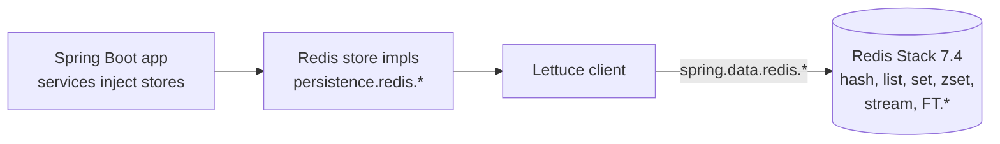
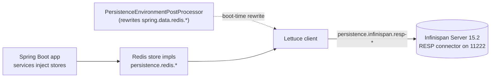
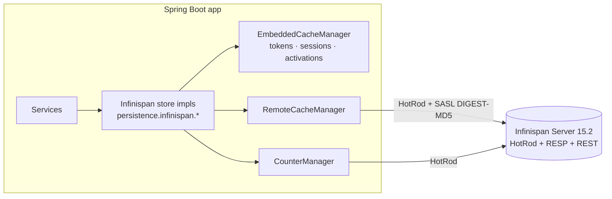

# Persistence

SocialGraph runs against one of two persistence backends, chosen at startup via
[`PersistenceProperties`](../src/main/java/com/intelligenta/socialgraph/config/PersistenceProperties.java):

- **Redis Stack** (default) — Lettuce against `redis/redis-stack-server:7.4.0-v0`.
  Everything in the [Redis schema](internals/redis-schema.md) is honoured, including
  `RediSearch` vector search and the Redis Streams embedding pipeline.
- **Infinispan** — two sub-modes: `resp` (RESP-compatible, drop-in Redis protocol
  over the existing Lettuce client) and `native` (HotRod client +
  in-process embedded cache manager for an ephemeral tier).

The backend is selected via two config properties:

```yaml
persistence:
  provider: ${PERSISTENCE_PROVIDER:redis}          # redis | infinispan
  infinispan:
    client-mode: ${INFINISPAN_CLIENT_MODE:resp}    # resp | native
```

Only one combination is active per run. All services talk to the persistence
layer through the [store interfaces](internals/persistence-abstraction.md);
they do not know which backend they are running against.

## Provider comparison

| Feature | Redis (default) | Infinispan RESP | Infinispan native |
|---|---|---|---|
| Service code changes | — | none | none (abstracted) |
| Lettuce client | yes, against Redis | yes, against Infinispan RESP endpoint | not used at service level |
| HotRod `RemoteCacheManager` | — | — | yes |
| Embedded `EmbeddedCacheManager` | — | — | yes, ephemeral tier |
| `CounterManager` | — | — | yes |
| RediSearch vector search (`/api/search/*`) | yes | no (gated off) | no (deferred to follow-up) |
| Redis Streams embedding queue | yes | no (gated off) | no (deferred to follow-up) |
| `MULTI`/`EXEC` post-create transaction | yes | yes (RESP supports it) | pending JTA upgrade |
| Sorted-set ranked timelines | yes | yes (RESP supports `ZREVRANGE`) | emulated via client-side sort |
| ACID across multiple keys | — | — | pending (transactional caches configured but not yet wired to writes) |
| Suitable for production today | yes | yes (full social graph minus search / embeddings) | dev / experimentation only |

See [infinispan-schema](internals/infinispan-schema.md) for the per-cache layout
under native mode and [redis-schema](internals/redis-schema.md) for the Redis /
RESP layout.

## Topology

### Redis mode



### Infinispan RESP mode



### Infinispan native mode



In native mode the app is expected to run alongside a dedicated Infinispan
Server. The plan anticipates the embedded cache manager joining the same
JGroups cluster for short-lived-data replication; today the embedded manager
runs in LOCAL mode and JGroups replication is a follow-up refresh.

## Environment variables

| Variable | Default | Notes |
|---|---|---|
| `PERSISTENCE_PROVIDER` | `redis` | `redis` or `infinispan` |
| `INFINISPAN_CLIENT_MODE` | `resp` | `resp` or `native`; ignored when provider=redis |
| `INFINISPAN_CLUSTER_NAME` | `socialgraph` | JGroups cluster name when the embedded manager joins the cluster (phase I-K) |
| `INFINISPAN_HOTROD_SERVERS` | `localhost:11222` | Comma-separated `host:port` list for the HotRod client in native mode |
| `INFINISPAN_HOTROD_USERNAME` | *(empty)* | SASL username for HotRod auth; empty disables auth |
| `INFINISPAN_HOTROD_PASSWORD` | *(empty)* | SASL password |
| `INFINISPAN_HOTROD_SASL_MECHANISM` | `DIGEST-MD5` | `DIGEST-MD5`, `PLAIN`, `SCRAM-SHA-512`, etc. |
| `INFINISPAN_HOTROD_SASL_REALM` | `default` | Server realm name |
| `INFINISPAN_RESP_HOST` | `localhost` | Host for the Infinispan RESP endpoint in RESP mode |
| `INFINISPAN_RESP_PORT` | `11222` | Port for the Infinispan RESP endpoint |
| `INFINISPAN_RESP_USERNAME` | *(empty)* | Lettuce username (forwarded to `spring.data.redis.username`) |
| `INFINISPAN_RESP_PASSWORD` | *(empty)* | Lettuce password (forwarded to `spring.data.redis.password`) |
| `INFINISPAN_EMBEDDED_CONFIG` | `infinispan-embedded.xml` | Reserved for a future XML-driven embedded manager; programmatic configuration is used today |
| `INFINISPAN_EPHEMERAL_TTL` | `PT24H` | ISO-8601 `Duration`. TTL of the ephemeral-tier caches (tokens, sessions, activations) |
| `INFINISPAN_TRANSACTIONAL_DEFAULT` | `false` | Reserved — switches the native impls over to transactional caches when the JTA upgrade lands |
| `INFINISPAN_JGROUPS_STACK` | `jgroups-tcp.xml` | Reserved — JGroups stack file for when the embedded manager joins the cluster |
| `INFINISPAN_JGROUPS_INITIAL_HOSTS` | *(empty)* | Reserved — TCPPING initial-hosts list |

The full table (including Redis / storage / AI) is in
[configuration.md](configuration.md).

## Running each mode

### Redis (default)

```bash
docker compose up -d redis
./mvnw spring-boot:run
```

No env vars needed. `./mvnw test` runs the full suite against a Testcontainers
Redis Stack instance.

### Infinispan RESP

```bash
docker compose --profile infinispan-resp up -d
PERSISTENCE_PROVIDER=infinispan \
INFINISPAN_CLIENT_MODE=resp \
INFINISPAN_RESP_USERNAME=admin \
INFINISPAN_RESP_PASSWORD=admin \
./mvnw spring-boot:run
```

The `PersistenceEnvironmentPostProcessor` (an
`org.springframework.boot.env.EnvironmentPostProcessor` registered in
`META-INF/spring/org.springframework.boot.env.EnvironmentPostProcessor.imports`)
rewrites `spring.data.redis.host/port/username/password` before Spring Boot
builds the `LettuceConnectionFactory`, so no service code is aware of the
endpoint swap.

Gated off in this mode:

- `/api/search/*` endpoints (404) — the `SearchController`, `VectorSearchService`,
  `RedisSearchIndexInitializer`, and RediSearch Lettuce client beans are all
  guarded by `@ConditionalOnProperty(persistence.provider=redis)`.
- The embedding pipeline (`EmbeddingWorker`, `ShareService`'s XADD to
  `embedding:queue`) — same guard.

Everything else — register / login / post / follow / timeline / reactions / etc.
— works unchanged because Infinispan RESP implements the hash / list / set /
sorted-set / `MULTI`/`EXEC` / `HINCRBY` / `EXPIRE` command families the services
depend on.

### Infinispan native

```bash
docker compose --profile infinispan up -d
PERSISTENCE_PROVIDER=infinispan \
INFINISPAN_CLIENT_MODE=native \
INFINISPAN_HOTROD_SERVERS=localhost:11222 \
INFINISPAN_HOTROD_USERNAME=admin \
INFINISPAN_HOTROD_PASSWORD=admin \
./mvnw spring-boot:run
```

Activates [`InfinispanConfig.Native`](../src/main/java/com/intelligenta/socialgraph/config/InfinispanConfig.java),
which builds:

- A `RemoteCacheManager` with SASL-authenticated HotRod client.
- A `CounterManager` derived from the remote manager.
- An `EmbeddedCacheManager` with 17 pre-defined caches covering the ephemeral
  and cluster tiers. See [infinispan-schema](internals/infinispan-schema.md).

The Infinispan store implementations under
[`persistence.infinispan.*`](../src/main/java/com/intelligenta/socialgraph/persistence/infinispan/)
activate, replacing their Redis counterparts.

## Operational notes

- The project `.gitignore` excludes `*.yml` including `application.yml`; the
  env-var table above is canonical. `application.yml` is regenerated per
  environment.
- `docs/internals/redis-schema.md` describes the Redis keyspace exactly.
  `docs/internals/infinispan-schema.md` describes the corresponding Infinispan
  cache layout.
- The `SessionServiceInfinispanRespTest` and `InfinispanNativeSmokeTest`
  integration tests exercise each mode end-to-end against Testcontainers
  Infinispan. See [testing.md](testing.md).
- Provider switching is **runtime-only**, not data-migration. Moving data
  between providers is out of scope for this repo; plan a dual-write / cutover
  externally if you need it.

## Related docs

- [Persistence abstraction](internals/persistence-abstraction.md) — the 12
  store interfaces and their Redis / Infinispan implementations.
- [Redis schema](internals/redis-schema.md) — the Redis / RESP adapter
  keyspace.
- [Infinispan schema](internals/infinispan-schema.md) — the native-mode cache
  layout.
- [Architecture](architecture.md) — component diagram.
- [Configuration](configuration.md) — every environment variable.
- [`CHANGELOG.md`](../CHANGELOG.md) — history of the Infinispan integration
  phases (I-A through I-L).
